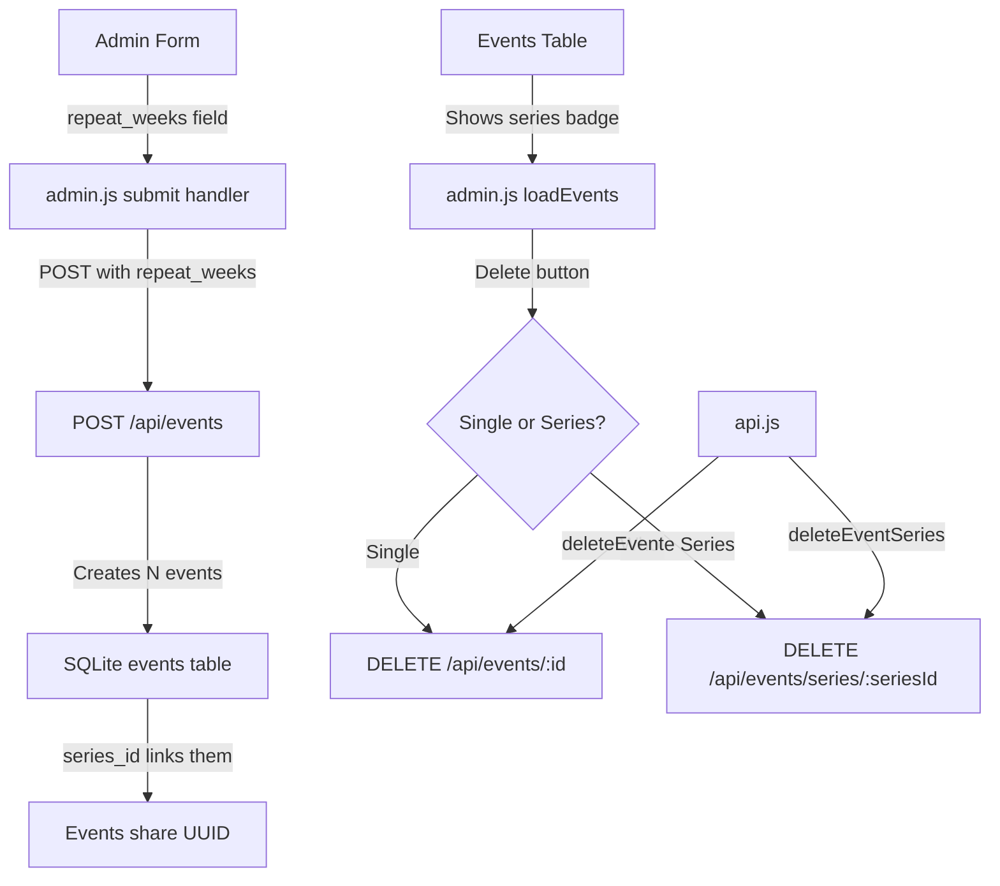

# Plan: Weekly Recurring Events in Admin UI

> **Überholt.** Dieser Plan beschreibt die erste, `repeat_weeks`-basierte
> Umsetzung. Sie wurde durch [serientermine-plan.md](serientermine-plan.md)
> ersetzt (eigene `series`-Tabelle, explizite Serien-Eingabe, Serienansicht).
> Nur noch als Historie relevant.

## Problem Statement

The backend already supports creating weekly recurring events via the `repeat_weeks` parameter on `POST /api/events`, but the admin UI has no way to set this value. Additionally, there is no UI for managing event series — e.g. viewing which events belong to a series, or deleting an entire series at once.

## Current State

### Backend (already implemented)
- `POST /api/events` accepts optional `repeat_weeks` (1–52) — creates N events spaced 7 days apart
- Events in a series share a `series_id` (UUID) in the database
- `DELETE /api/events/series/:seriesId` deletes all events in a series
- Database schema includes `series_id TEXT DEFAULT NULL` on the `events` table with an index

### Frontend gaps
- **admin.html**: No input field for repeat weeks in the event creation form
- **admin.js**: Form submit handler does not send `repeat_weeks`; event table does not show series info; delete only supports single events
- **api.js**: No `deleteEventSeries()` method
- **calendar.js**: No visual indicator that an event belongs to a series

## Architecture



## Changes by File

### 1. `public/admin.html`
- Add a `<div class="form-group">` with `<input type="number" id="eventRepeatWeeks">` labeled "Wöchentlich wiederholen (Wochen)" to the event form
- Place it in a new form-row between the Location/All-day row and the Description row
- Add a "Serie" column header to the events table

### 2. `public/js/admin.js`

#### Form submit handler (line ~162)
- Read `eventRepeatWeeks` value from the input
- Only include `repeat_weeks` in the POST data when creating a **new** event (not editing)
- Show an appropriate toast message reflecting the number of events created

#### Edit mode (editEvent function, line ~191)
- Hide the repeat-weeks input when editing (it only applies to creation)
- Show a note if the event belongs to a series

#### Delete (deleteEvent function, line ~214)
- When deleting an event that has a `series_id`, show a dialog asking:
  - "Nur diesen Termin löschen" (delete single)
  - "Alle Termine der Serie löschen" (delete entire series)
  - "Abbrechen" (cancel)

#### Reset form (resetEventForm function, line ~226)
- Reset `eventRepeatWeeks` to 1
- Show the repeat-weeks input again (in case it was hidden during edit)

#### Events table rendering (loadEvents function, line ~124)
- Add a "Serie" column that shows a 🔁 badge when `series_id` is not null
- Modify the delete button to pass `series_id` to the delete handler

### 3. `public/js/api.js`
- Add `deleteEventSeries(seriesId)` method that calls `DELETE /api/events/series/:seriesId`

### 4. `public/js/calendar.js` (optional enhancement)
- Add a small 🔁 icon to events that have a `series_id`, indicating they are part of a recurring series

### 5. `tests/events.test.js`
- Add test: "should create a weekly series with repeat_weeks"
- Add test: "should delete an entire series by series_id"
- Add test: "should return series_id in event responses"

## UI Mockup

### Event Form (new row added)

```
┌─────────────────────────┬──────────────────────────┐
│ Ort                     │ ☐ Ganztägig              │
├─────────────────────────┼──────────────────────────┤
│ Wöchentl. wiederholen   │                          │
│ [  1  ] Wochen          │ (nur bei neuem Termin)   │
├─────────────────────────┴──────────────────────────┤
│ Beschreibung                                       │
│ [                                                ] │
└────────────────────────────────────────────────────┘
```

### Events Table (new column)

```
┌──────────┬───────────┬───────┬───────┬──────────┬───────┬──────────┐
│ Titel    │ Kategorie │ Start │ Ende  │ Ganztägig│ Serie │ Aktionen │
├──────────┼───────────┼───────┼───────┼──────────┼───────┼──────────┤
│ Training │ ECB       │ 18:00 │ 20:00 │          │ 🔁    │ ✏️ 🗑️    │
└──────────┴───────────┴───────┴───────┴──────────┴───────┴──────────┘
```

### Delete Series Dialog

When user clicks 🗑️ on a series event:

```
┌──────────────────────────────────────┐
│ Termin "Training" löschen?           │
│                                      │
│ Dieser Termin gehört zu einer Serie. │
│                                      │
│ [Nur diesen Termin]                  │
│ [Ganze Serie löschen]                │
│ [Abbrechen]                          │
└──────────────────────────────────────┘
```

## Execution Order

1. `admin.html` — Add repeat weeks input + series table column
2. `api.js` — Add `deleteEventSeries()` method
3. `admin.js` — Wire up repeat weeks in submit, hide on edit, reset on cancel, series-aware delete, series badge in table
4. `calendar.js` — Optional: series badge on calendar events
5. `events.test.js` — Add series creation and deletion tests
6. End-to-end verification
